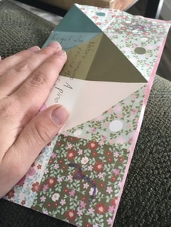

# cootie-catcher

## I'm designing this website to show you how to make cootie catchers and how they work.

1. first I'll show you how to make them, they are really easy.

1. get a piece of Square paper and fold the top to the bottom  of the paper so it looks like this.

1. when turn the paper 90° and do the same thing

